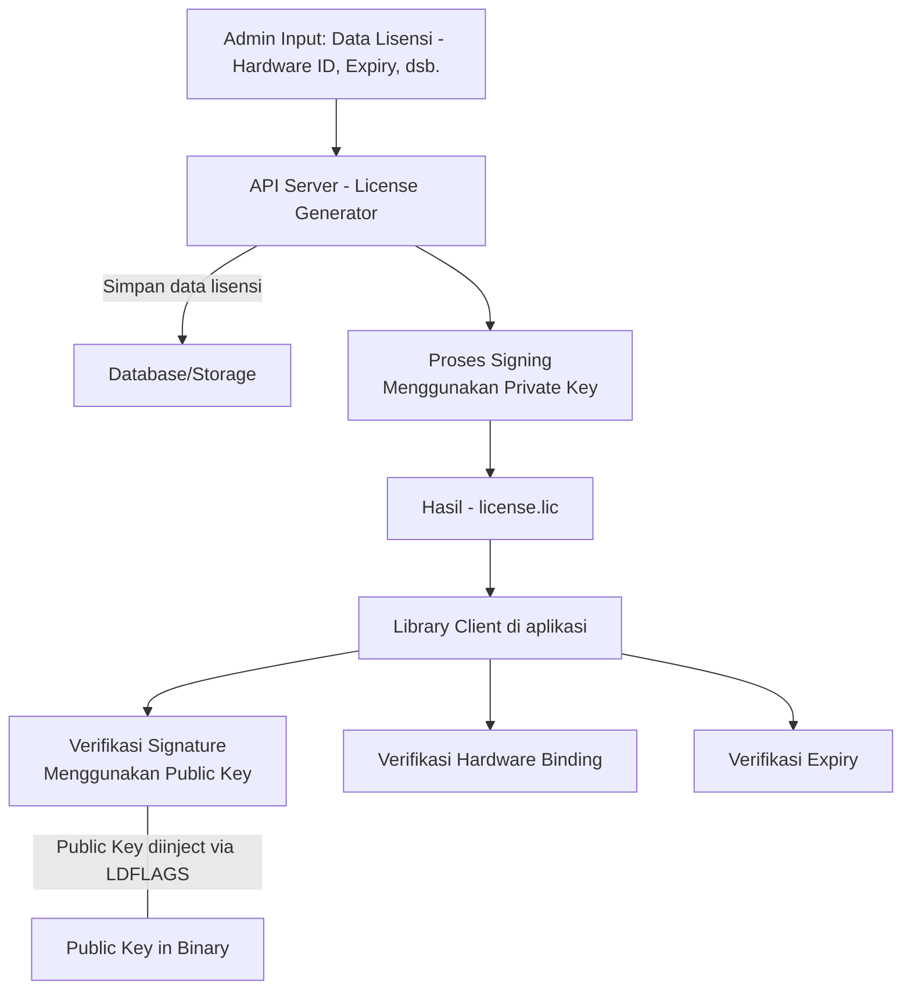

# Go License Management System

A powerful open-source license management system built with Go that generates and manages offline-validated, hardware-bound licenses with digital signatures.

**Current Version: 2.0.0**

## Overview

This project provides a complete solution for software license management with two main components:

1. **License Generation (Server-Side)**: Create and sign licenses with hardware binding and expiration dates
2. **License Verification (Client-Side)**: Verify licenses offline with hardware binding validation

### Key Features

- **Offline License Validation**: Generate licenses that can be verified without internet connectivity
- **Hardware Binding**: Bind licenses to specific hardware identifiers (MAC address, hard drive ID, etc.)
- **Digital Signatures**: Secure licenses with cryptographic signatures to prevent tampering
- **Expiration Management**: Set and enforce license expiration dates
- **Serial Number Tracking**: Unique serial numbers for better license management and tracking
- **Security-Focused Design**: Clear separation between generation and verification components
- **Binary License Format**: Licenses are stored in a compact binary format that is not human-readable (v2.0.0+)
- **Legacy Support**: Maintains backward compatibility with JSON licenses from v1.x

## Architecture

The system consists of two main components:

1. **Server Side (License Generator)**: 
   - License generation with digital signing capabilities
   - Key management for license signing
   - Command-line tool for license creation

2. **Client Side (License Verifier)**: 
   - License verification library
   - Hardware binding verification
   - Expiration date checking
   - Offline signature validation

### System Workflow Diagram



## Project Structure

```
go-license/
├── cmd/
│   ├── example/        # Example client application using the license verification library
│   └── licforge/       # Command-line tool for license generation
├── pkg/
│   ├── licgen/         # License generation package (server-side only)
│   └── licverify/      # License verification package (client-side)
```

## Security Considerations

This project is designed with security in mind:

- **Separation of Concerns**: The license generation code (`pkg/licgen`) is completely separate from the verification code (`pkg/licverify`). This ensures that client applications only include verification code, not key generation or signing capabilities.

- **Binary Size and Attack Surface**: When you compile a client application that imports only the verification package, the binary will not include any of the generation code, reducing the attack surface.

- **Key Management**: Private keys for signing should be kept secure on the server side and never distributed to clients.

## Getting Started

### Using the License Verification Library in Your Application

1. Import the verification package:
   ```go
   import "github.com/luhtfiimanal/go-license/pkg/licverify"
   ```

2. Create a verifier with your public key:
   ```go
   // Public key can be injected at build time
   var publicKey string

   verifier, err := licverify.NewVerifier(publicKey)
   if err != nil {
       log.Fatalf("Failed to create verifier: %v", err)
   }
   ```

3. Load and verify a license:
   ```go
   license, err := verifier.LoadLicense("license.lic")
   if err != nil {
       log.Fatalf("Failed to load license: %v", err)
   }

   err = license.IsValid(verifier)
   if err != nil {
       log.Fatalf("License validation failed: %v", err)
   }

   // License is valid, continue with application logic
   ```

## Using the licforge CLI Tool

The `licforge` CLI tool provides a comprehensive interface for license management. It supports key generation, license creation, and license verification.

### Installation

Build the CLI tool from source:

```bash
go build -o licforge ./cmd/licforge
```

For convenience, you can move the binary to a location in your PATH.

### Command Overview

```
licforge [command] [options]
```

Available commands:
- `keygen` - Generate RSA key pairs
- `genlicense` - Generate licenses
- `info` - Display license information
- `version` - Show version information
- `help` - Display usage information

### Generating Key Pairs

Before generating licenses, you need to create an RSA key pair:

```bash
# Generate a 2048-bit RSA key pair (default)
./licforge keygen

# Generate a 4096-bit RSA key pair in a custom directory
./licforge keygen -size 4096 -dir /path/to/keys

# Force overwrite of existing keys
./licforge keygen -force
```

Options:
- `-size` - RSA key size (2048, 3072, or 4096 bits)
- `-dir` - Directory to store keys (default: "keys")
- `-force` - Overwrite existing keys

### Generating Licenses

Create licenses with hardware binding and custom features:

```bash
# Generate a license with basic information
./licforge genlicense -id "LICENSE-001" -customer "Acme Corp" -product "SuperApp" -serial "SN12345"

# Generate a license with hardware binding
./licforge genlicense -id "LICENSE-002" -customer "Acme Corp" -product "SuperApp" -serial "SN67890" \
  -macs "00:11:22:33:44:55,66:77:88:99:AA:BB" \
  -diskids "S1234567,X9876543" \
  -hostnames "server1,server2"

# Generate a license with custom validity and features
./licforge genlicense -id "LICENSE-003" -customer "Acme Corp" -product "SuperApp" -serial "SN-ABCDE" \
  -days 730 -features "basic,premium,enterprise" \
  -key /path/to/private.pem -output /path/to/license.lic
```

Options:
- `-id` - License ID (required)
- `-customer` - Customer ID (required)
- `-product` - Product ID (required)
- `-serial` - Serial number (required)
- `-days` - License validity in days (default: 365)
- `-features` - Comma-separated list of features (default: "basic")
- `-macs` - Comma-separated list of MAC addresses for hardware binding
- `-diskids` - Comma-separated list of disk IDs for hardware binding
- `-hostnames` - Comma-separated list of hostnames for hardware binding
- `-key` - Path to private key (default: "keys/private.pem")
- `-output` - Output license file path (default: "license.lic")
- `-auto-hardware` - Automatically detect and use current hardware information
- `-interactive` - Use interactive mode for license generation

### Version 2.0.0 Changes

#### Binary License Format

Starting with version 2.0.0, licenses are generated exclusively in a binary format rather than JSON. This provides several benefits:

- **Improved Security**: Binary licenses are not human-readable in a text editor
- **Smaller Size**: Binary format produces more compact license files
- **Tamper Resistance**: Combined with digital signatures, makes licenses more difficult to modify

#### Backward Compatibility

While new licenses are generated only in binary format, the system maintains backward compatibility:

- The verification library can still read and validate legacy JSON licenses from v1.x
- The `info` command will automatically detect and display information for both binary and legacy JSON licenses

#### Hardware Auto-Detection

Version 2.0.0 adds the ability to automatically detect and use the current machine's hardware information:

```bash
# Generate a license using current hardware information
./licforge genlicense -id "LICENSE-001" -customer "Acme Corp" -product "SuperApp" -serial "SN12345" -auto-hardware
```

### Interactive License Generation

For a guided experience, use the interactive mode:

```bash
./licforge genlicense -interactive
```

This will prompt you for all required information step by step.

### Verifying and Displaying License Information

Examine and verify a license file:

```bash
# Display information about the default license file
./licforge info

# Specify custom license and public key files
./licforge info -license /path/to/license.lic -key /path/to/public.pem
```

Options:
- `-license` - Path to license file (default: "license.lic")
- `-key` - Path to public key file (default: "keys/public.pem")

The output includes:
- License signature verification
- Expiration status
- Hardware binding validation
- Detailed license information (ID, customer, product, features, etc.)
- Days remaining until expiration

## Building Client Applications with Embedded Public Key

For security reasons, it's recommended to embed the public key directly into your client application binary at build time rather than loading it from a file that could be tampered with.

### Preparing Your Public Key for Injection

First, you need to format your public key for injection. Since public keys contain newlines, you'll need to prepare it:

```bash
# Read the public key and format it for ldflags
PUBLIC_KEY=$(cat keys/public.pem | tr '\n' '#' | sed 's/#/\\n/g')
```

### Declaring the Public Key Variable

In your client application, declare a variable to hold the public key:

```go
package main

import (
    "log"
    "github.com/luhtfiimanal/go-license/pkg/licverify"
)

// This variable will be populated at build time
var publicKey string

func main() {
    // Use the injected public key
    verifier, err := licverify.NewVerifier(publicKey)
    if err != nil {
        log.Fatalf("Failed to create verifier: %v", err)
    }
    
    // Rest of your code...
}
```

### Building with the Injected Public Key

#### Method 1: Direct Injection (for testing)

```bash
# Simple injection (for testing only)
go build -ldflags "-X 'main.publicKey=-----BEGIN PUBLIC KEY-----\nMIIB...AQAB\n-----END PUBLIC KEY-----'" -o client_app ./cmd/client-example
```

#### Method 2: Using a Variable (recommended)

```bash
# Read the public key and format it for ldflags
PUBLIC_KEY=$(cat keys/public.pem | tr '\n' '#' | sed 's/#/\\n/g')

# Build with the formatted public key
go build -ldflags "-X 'main.publicKey=$PUBLIC_KEY'" -o client_app ./cmd/client-example
```

#### Method 3: Using a Build Script

Create a build script (`build.sh`):

```bash
#!/bin/bash

# Read and format the public key
PUBLIC_KEY=$(cat keys/public.pem | tr '\n' '#' | sed 's/#/\\n/g')

# Build the client application with the injected key
go build -ldflags "-X 'main.publicKey=$PUBLIC_KEY'" -o client_app ./cmd/client-example

echo "Built client_app with embedded public key"
```

Make it executable and run it:

```bash
chmod +x build.sh
./build.sh
```

### Verifying the Injected Key

To verify that your public key was correctly injected, you can add a debug option to your application:

```go
if os.Getenv("DEBUG") == "1" {
    fmt.Println("Injected public key:\n", publicKey)
}
```

Then run with:

```bash
DEBUG=1 ./client_app
```

## License

[MIT License](LICENSE)
